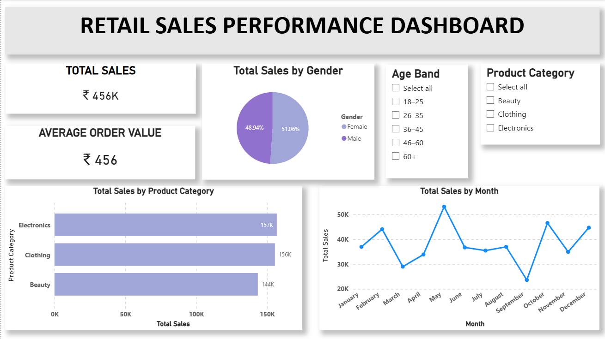

# Power BI Retail Sales Dashboard

Retail Sales Performance Dashboard built using Power BI to analyze sales trends, customer segments, and product categories.

## Dashboard Preview

## Project Overview

This project analyzes retail sales performance using Power BI.
The dashboard provides insights into sales trends, customer demographics, and product category performance.

## Key Metrics

* Total Sales
* Average Order Value
* Sales by Product Category
* Sales by Month
* Customer Gender Distribution

## Tools Used

* Power BI
* Data Visualization
* Data Analysis

